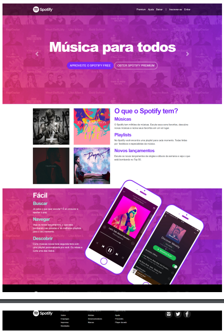

# Projeto: Clone da Tela do Spotify 🎶

## Descrição 📚

Este projeto foi desenvolvido como exercicio de aula, com o objetivo de replicar a interface do Spotify de 2016. O foco principal foi aprender e aplicar os conceitos de Bootstrap, juntamente com conhecimentos de HTML, CSS e JavaScript adquiridos no Módulo 3, da Formação Dev Full Stack Junior da [+prati](https://www.maisprati.com.br/) e [codifica](https://www.codificaedu.com.br/).

## Link da aplicação

[Spotify](https://clonespot.netlify.app/)

## Objetivos do Projeto 🎯

- Aprender Bootstrap: Utilizar a documentação do Bootstrap para implementar componentes responsivos e estilizados.
- mplementar Conhecimentos de HTML, CSS e JavaScript: Aplicar técnicas e práticas ensinadas no módulo 3 do curso para criar uma interface atrativa e funcional.
- Desenvolver Habilidades de Clonagem de Interfaces: Aprender a observar e replicar interfaces existentes, entendendo a estrutura e estilização necessária.

## Tecnologias Utilizadas 💻

- HTML
- CSS
- Bootstrap

## Configurações e Execução 🛠️

Para executar os exercícios, você precisará de um ambiente com o [Node.js](https://nodejs.org/) instalado.

- Faça o clone deste repositório na máquina local:

```bash
# HTTPS:
git clone https://github.com/Andressavcon/clone-spotify.git

# SSH:
git clone git@github.com:Andressavcon/clone-spotify.git
```

- Instalar as bibliotecas

```bash
npm install
```

- Abrir o arquivo `index.html` no seu navegador web.

## Imagens base 🖼️


<br>


## Notas Finais 📝

A experiência foi muito interessante e importante, pois me permitiu aprender sobre muitas das classes e componentes do Bootstrap para construir layouts com mais facilidade e organização. Ainda planejo ajustar alguns detalhes de responsividade para garantir uma experiência consistente em diferentes dispositivos.
